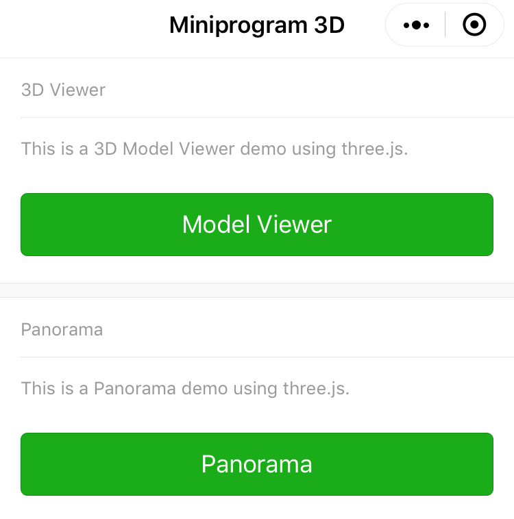
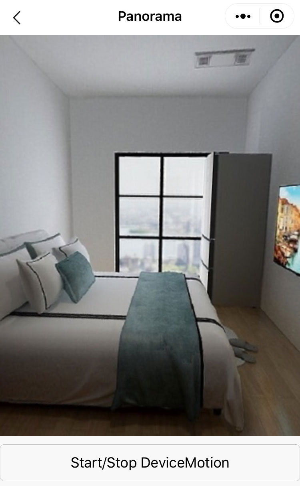
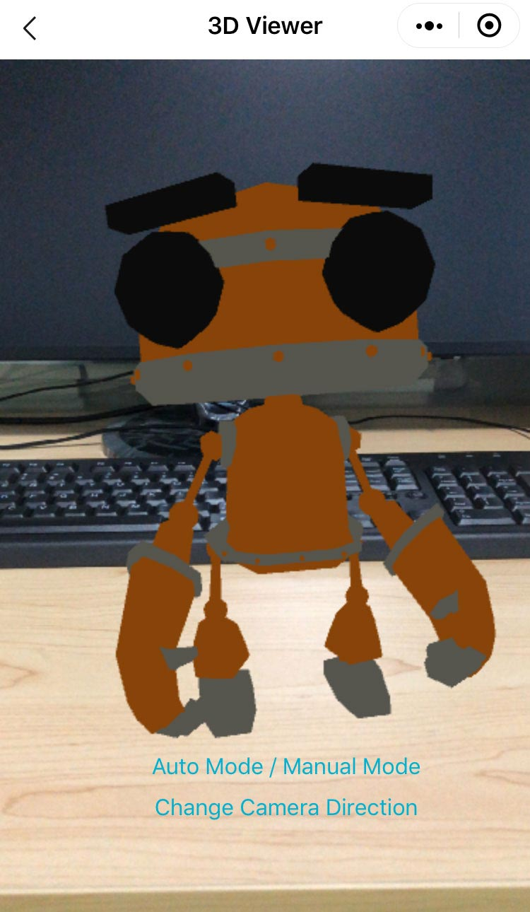

[Chinese README](https://zhuanlan.zhihu.com/p/82773324)  

## Updated

| Date　　　| Update |
| -- | -- |
| 2021-07-21 | New: This project is the same as https://github.com/sanyuered/WeChat-MiniProgram-AR-3D, but it is a pure front-end website. |

## Visit a live example

https://sanyuered.github.io/AR-3D/

## Introduction of 3D website with THREE.JS

Three.js is a JavaScript 3D library.

[Three.js](https://github.com/mrdoob/three.js)

 
Index Page



## Panorama Viewer



When start a device motion, the device orientation control will rotate the screen.

When stop the device motion, use gestures to rotate the screen.

## 3D Viewer



We can rotate the screen by a device orientation control and gestures.

## Set your image url

File: /package_panorama/photo/photo.js

```javascript
// A panorama image url
const imageUrl = '../../assets/sample.jpg';
```

## Set your model url

File: /package_3d_viewer/camera/camera.js

```javascript
// a gltf model url
const modelUrl = '../../assets/robot.glb';
```